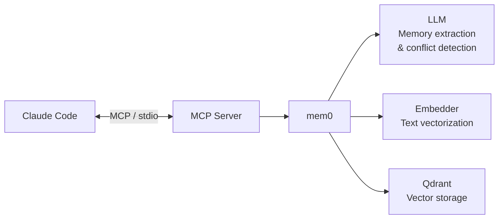

# agent-mem0

[](https://www.python.org/downloads/)
[](LICENSE)

[中文文档](README.md)

**Cross-session memory for Claude Code.**

Every Claude Code conversation starts from scratch — it doesn't remember your preferences, technical decisions, or project context. agent-mem0 injects persistent memory via an MCP Server, allowing Claude to carry context across sessions.

## Architecture



**How it works:**
- **mem0** handles semantic understanding of memories — extracting key information, detecting conflicts between old and new memories, and automatically merging updates
- **LLM** provides semantic capabilities for mem0 (e.g., recognizing that "user likes pytest" and "user prefers pytest framework" are the same memory)
- **Embedder** converts text into vectors for similarity search in Qdrant
- **Qdrant** stores and retrieves memory vectors, supporting both Docker and pure local modes

## Quick Start

### Prerequisites

- Python 3.10+
- Docker (recommended, for running Qdrant) or use pure local mode
- [Claude Code](https://docs.anthropic.com/en/docs/claude-code)

### 1. Install

```bash
git clone https://github.com/ccperdst-lab/agent-mem0.git
cd agent-mem0
pip install -e .
```

### 2. Global Setup (one-time)

```bash
agent-mem0 install
```

The interactive wizard will guide you through:
- Choosing an LLM Provider (Ollama / OpenAI / Anthropic / LiteLLM)
- Choosing an Embedding Provider (Ollama / OpenAI / LiteLLM)
- Configuring Qdrant storage mode (Docker / Local)
- Auto-detecting and installing Ollama, Docker (if needed)
- Pulling required models and images
- Writing config file and CLAUDE.md memory rules

### 3. Project Setup (once per project)

```bash
cd your-project
agent-mem0 setup
```

This creates in your project directory:
- `.mcp.json` — MCP Server config for Claude Code
- `.claude/skills/agent-memory/` — `/agent-memory:init` Skill

### 4. Start Using

Launch Claude Code and the memory system takes effect automatically. On first use, run:

```
/agent-memory:init
```

This generates project-level context (CLAUDE.md) to help Claude better understand your project.

## Features

### Cross-Session Memory

Claude automatically remembers your preferences, technical decisions, and project context. Relevant memories are retrieved at the start of each new session — no need to repeat background information.

### Project Isolation + Global Sharing

Each project's memories are isolated from one another, while global memories (personal preferences, general rules) are shared. During search, project and global memories are ranked together by relevance score — no artificial caps on either source.

### Smart Search

Wide candidate retrieval → relevance threshold filtering → TTL time filtering → sort by score descending → truncate and return. Each result includes a relevance score. Search parameters are fully configurable.

### Multiple Provider Support

| Type | Available Providers |
|------|-------------------|
| LLM | Ollama, OpenAI, Anthropic, LiteLLM, Custom |
| Embedder | Ollama, OpenAI, LiteLLM, Custom |
| Vector Store | Qdrant (Docker / Local) |

### Async Writes & Auto GC

Memory writes are executed asynchronously via a background queue, never blocking Claude's responses. Expired memories (beyond TTL) are automatically flagged during search and batch-deleted when the threshold is reached.

### Memory Rule Injection

During installation, 3 mandatory memory rules are written to `~/.claude/CLAUDE.md`, ensuring Claude proactively searches and stores memories in every session.

## MCP Tools

After installation, Claude Code can operate on memories through these MCP tools:

| Tool | Description | Key Parameters |
|------|-------------|---------------|
| `memory_search` | Semantic memory search | `query`, `project`, `days`, `top_k` |
| `memory_add` | Add memory (auto dedup & merge) | `text`, `project`, `metadata` |
| `memory_list` | List all memories | `project`, `days` |
| `memory_delete` | Delete a specific memory | `memory_id` |

> These tools are called automatically by Claude — you typically don't need to invoke them manually.

## Configuration

Config file is located at `~/.agent-mem0/config.yaml`, using a **shadow config** approach: the code has built-in defaults for all fields, and the user config file only needs to specify the fields you want to override.

### Common Scenarios

**Using OpenAI:**

```yaml
llm:
  provider: openai
  model: gpt-4o-mini
  api_key: "sk-..."

embedder:
  provider: openai
  model: text-embedding-3-small
  api_key: "sk-..."
```

**Using Ollama (local deployment, no API key needed):**

```yaml
llm:
  provider: ollama
  model: qwen2.5:7b
  base_url: http://localhost:11434

embedder:
  provider: ollama
  model: nomic-embed-text
  base_url: http://localhost:11434
```

**Using LiteLLM proxy (e.g., Azure OpenAI):**

```yaml
llm:
  provider: litellm
  model: azure_openai/gpt-4o
  base_url: https://your-litellm-proxy.com
  api_key: "your-key"
```

**Tuning search parameters:**

```yaml
memory:
  search_top_k: 20        # Candidates per search call
  search_threshold: 0.3   # Relevance threshold (0 = no filtering)
  search_max_results: 10  # Max entries returned
  default_ttl_days: 30    # Memory retention period in days
```

## CLI Commands

| Command | Description |
|---------|-------------|
| `agent-mem0 install` | Global install wizard: configure providers, storage, memory rules |
| `agent-mem0 setup` | Project-level setup: write MCP config and Skill |
| `agent-mem0 status` | Show system status: Qdrant connection, provider config, memory stats |
| `agent-mem0 uninstall` | Uninstall: remove config and artifacts, preserve memory data |
| `agent-mem0 uninstall --purge` | Full uninstall: also delete memory data and Docker container |

## Data Safety

agent-mem0 strictly separates **regenerable config** from **irreplaceable user data**:

```
~/.agent-mem0/              <- Config (regenerable, just re-run install)
  ├── config.yaml
  ├── projects.json
  └── logs/

~/.local/share/agent-mem0/  <- User memory data (irreplaceable)
  └── qdrant_storage/
```

- `agent-mem0 uninstall`: only removes config and artifacts, **never touches memory data**
- `agent-mem0 uninstall --purge`: also deletes memory data and Docker container, requires **double confirmation**

## FAQ

**Q: Qdrant connection failed**

Check if Docker is running:
```bash
docker ps | grep qdrant
# If not running:
docker start agent-mem0-qdrant
```

Or switch to local mode (no Docker needed):
```yaml
vector_store:
  mode: local
```

**Q: Ollama model pull failed**

Confirm Ollama service is running:
```bash
ollama list
# If not running:
ollama serve
```

**Q: Connection fails behind a proxy**

agent-mem0 automatically adds local service addresses (localhost, etc.) to `NO_PROXY`. If issues persist, set it manually:
```bash
export NO_PROXY=localhost,127.0.0.1
```

**Q: How to check current status?**

```bash
agent-mem0 status
```

Shows Qdrant connection status, provider config, registered projects, and memory statistics.

## License

[Apache-2.0](LICENSE)
