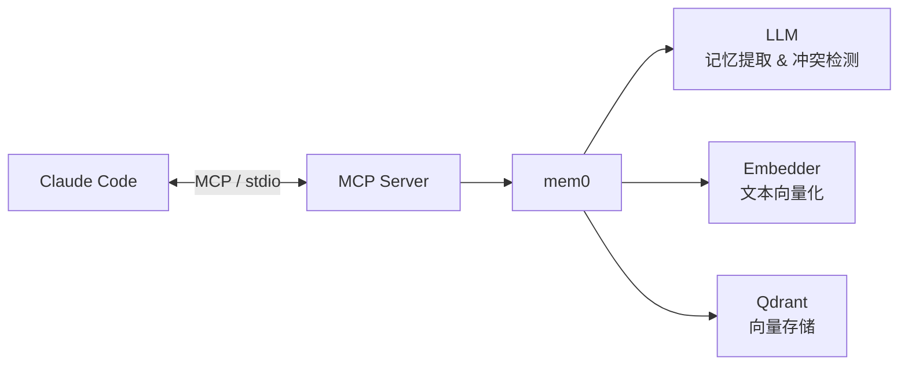

# agent-mem0

[](https://www.python.org/downloads/)
[](https://pypi.org/project/mcp-mem0/)
[](LICENSE)

[English](README-en.md)

**为 Claude Code 提供跨 Session 记忆能力。**

Claude Code 每次对话都是全新的 — 它不记得你的偏好、技术决策、项目上下文。agent-mem0 通过 MCP Server 为 Claude 注入持久记忆，让它在新 Session 中也能延续之前的对话上下文。

## 架构



**工作原理：**
- **mem0** 负责记忆的语义理解 — 提取关键信息、检测新旧记忆冲突、自动合并更新
- **LLM** 为 mem0 提供语义能力（判断"用户喜欢用 pytest"和"用户偏好 pytest 框架"是同一条记忆）
- **Embedder** 将文本转为向量，供 Qdrant 进行相似度搜索
- **Qdrant** 存储和检索记忆向量，支持 Docker、纯本地和外部连接三种模式

## 快速开始

### 前置条件

- Python 3.10+
- Docker（推荐，用于运行 Qdrant）或使用纯本地模式
- [Claude Code](https://docs.anthropic.com/en/docs/claude-code)

### 1. 安装

```bash
pip install mcp-mem0
```

或从源码安装：

```bash
git clone https://github.com/ccperdst-lab/agent-mem0.git
cd agent-mem0
pip install -e .
```

### 2. 全局配置（一次性）

**交互式向导：**

```bash
agent-mem0 install
```

向导会引导你完成：
- 选择 LLM Provider（Ollama / OpenAI / Anthropic / LiteLLM）
- 选择 Embedding Provider（Ollama / OpenAI / LiteLLM）
- 配置 Qdrant 存储模式（Docker / Local / External）
- 自动检测并安装 Ollama、Docker（如需要）
- 自动拉取所需模型和镜像
- 写入配置文件和 CLAUDE.md 记忆规则

**非交互模式（CI/自动化）：**

```bash
# 使用推荐预设（自动检测硬件选择模型）
agent-mem0 install --default

# 指定预设
agent-mem0 install --default --preset cloud --api-key "sk-..."
```

可用预设：`recommended`（自动选择）、`light`（轻量本地）、`cloud`（云端 API）。

### 3. 项目配置（每个项目一次）

```bash
cd your-project
agent-mem0 setup
```

这一步会在项目目录下创建：
- `.mcp.json` — Claude Code 的 MCP Server 配置
- `.claude/skills/agent-memory/` — `/agent-memory:init` Skill

### 4. 开始使用

启动 Claude Code，记忆系统自动生效。首次可运行：

```
/agent-memory:init
```

生成项目级上下文（CLAUDE.md），帮助 Claude 更好地理解你的项目。

## 功能特性

### 跨 Session 记忆

Claude 自动记住你的偏好、技术决策、项目上下文。新 Session 开启时自动检索相关记忆，无需重复交代背景。

### 项目级隔离 + 全局共享

每个项目的记忆互相隔离，同时支持全局记忆（如个人偏好、通用规则）。搜索时项目记忆和全局记忆按相关性统一排序，公平竞争。

### 智能记忆管理

- **场景驱动的工具选择**：5 条强制规则确保 Claude 在正确的时机使用正确的记忆工具
- **冲突检测**：修改已有架构/决策时自动检索并更新相关记忆，而不是创建重复记忆
- **搜索管线**：宽取候选 → 相关性阈值过滤 → TTL 时间过滤 → score 排序 → 截断返回
- **可选精排**：支持 Reranker（sentence-transformer / LLM / Cohere），在向量检索后二次精排提升结果质量

### 多 Provider 支持

| 类型 | 可选 Provider |
|------|--------------|
| LLM | Ollama, OpenAI, Anthropic, LiteLLM |
| Embedder | Ollama, OpenAI, LiteLLM |
| 向量存储 | Qdrant (Docker / Local / External) |
| Reranker | sentence-transformer, LLM, Cohere, HuggingFace（可选） |

### 异步写入 & 自动 GC

记忆写入通过后台队列异步执行，不阻塞 Claude 的响应。过期记忆（超过 TTL）在搜索时自动标记，累积到阈值后批量清理。

### 记忆规则注入

安装时自动向 `~/.claude/CLAUDE.md` 写入 5 条强制记忆规则，覆盖 search / add / update / delete / list / history 全部 6 个工具的使用时机，确保 Claude 在每个 Session 中主动管理记忆。

## MCP 工具

安装后，Claude Code 可通过以下 MCP 工具操作记忆：

| 工具 | 说明 | 关键参数 |
|------|------|---------|
| `memory_search` | 语义搜索记忆 | `query`, `project`, `days`, `top_k` |
| `memory_add` | 添加记忆（自动去重和合并） | `text`, `project`, `metadata` |
| `memory_update` | 更新已有记忆内容 | `memory_id`, `text` |
| `memory_delete` | 删除指定记忆 | `memory_id` |
| `memory_list` | 列出所有记忆 | `project`, `days` |
| `memory_history` | 查看记忆变更历史 | `memory_id` |

> 这些工具由 Claude 根据记忆规则自动调用，通常不需要你手动操作。

## 配置

配置文件路径因平台而异：

| 平台 | 配置目录 | 数据目录 | 日志目录 |
|------|---------|---------|---------|
| macOS | `~/Library/Application Support/agent-mem0/` | 同配置目录 | `~/Library/Logs/agent-mem0/` |
| Linux | `~/.config/agent-mem0/` | `~/.local/share/agent-mem0/` | `~/.local/state/agent-mem0/log/` |
| Windows | `%APPDATA%\agent-mem0\` | `%LOCALAPPDATA%\agent-mem0\` | `%LOCALAPPDATA%\agent-mem0\Logs\` |

采用 **shadow config** 机制：代码内置完整默认值，用户配置文件只需写你想覆盖的字段。

### 常见配置场景

**使用 OpenAI：**

```yaml
llm:
  provider: openai
  model: gpt-4o-mini
  api_key: "sk-..."

embedder:
  provider: openai
  model: text-embedding-3-small
  api_key: "sk-..."
```

**使用 Ollama（本地部署，无需 API Key）：**

```yaml
llm:
  provider: ollama
  model: qwen2.5:7b
  base_url: http://localhost:11434

embedder:
  provider: ollama
  model: nomic-embed-text
  base_url: http://localhost:11434
```

**使用 LiteLLM 代理（如 Azure OpenAI）：**

```yaml
llm:
  provider: litellm
  model: azure_openai/gpt-4o
  base_url: https://your-litellm-proxy.com
  api_key: "your-key"
```

**调节搜索参数：**

```yaml
memory:
  search_top_k: 20        # 每路搜索候选数量
  search_threshold: 0.3   # 相关性阈值（0 = 不过滤）
  search_max_results: 10  # 最终返回最大条数
  default_ttl_days: 30    # 记忆保留天数
```

**启用 Reranker（可选）：**

```yaml
reranker:
  provider: sentence_transformer
  config:
    model: cross-encoder/ms-marco-MiniLM-L-6-v2
    top_k: 10
```

需要额外安装：`pip install mcp-mem0[reranker]`

## CLI 命令

| 命令 | 说明 |
|------|------|
| `agent-mem0 install` | 全局安装向导：配置 Provider、存储、记忆规则 |
| `agent-mem0 install --default` | 非交互模式：自动检测硬件，使用推荐配置 |
| `agent-mem0 setup` | 项目级配置：写入 MCP 配置和 Skill |
| `agent-mem0 status` | 查看系统状态：Qdrant 连接、Provider 配置、记忆统计 |
| `agent-mem0 uninstall` | 卸载：移除配置和产物，保留记忆数据 |
| `agent-mem0 uninstall --purge` | 彻底卸载：额外删除记忆数据和 Docker 容器 |

## 常见问题

**Q: Qdrant 连接失败**

检查 Docker 是否运行：
```bash
docker ps | grep qdrant
# 如果没有运行：
docker start agent-mem0-qdrant
```

或切换到 Local 模式（无需 Docker）：
```yaml
vector_store:
  mode: local
```

**Q: Ollama 模型拉取失败**

确认 Ollama 服务已启动：
```bash
ollama list
# 如果未启动：
ollama serve
```

**Q: 代理环境下连接失败**

agent-mem0 会自动将本地服务地址（localhost 等）加入 `NO_PROXY`。如果仍有问题，手动设置：
```bash
export NO_PROXY=localhost,127.0.0.1
```

**Q: 如何查看当前状态？**

```bash
agent-mem0 status
```

会显示 Qdrant 连接状态、Provider 配置、已注册项目和记忆统计。

## License

[Apache-2.0](LICENSE)
